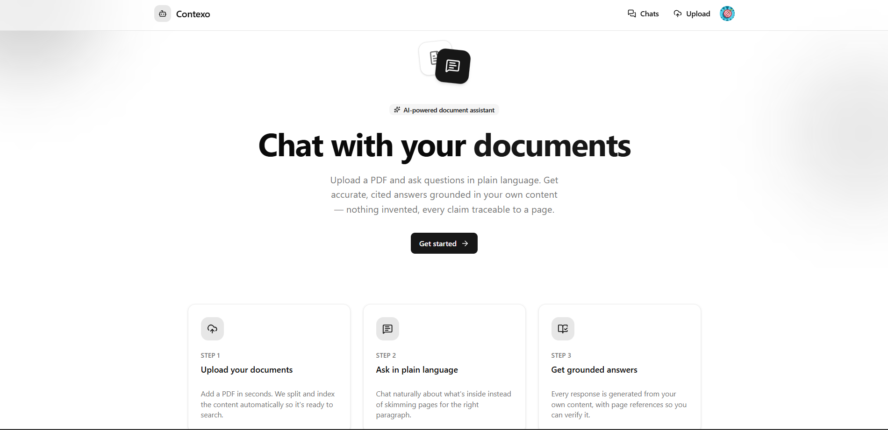
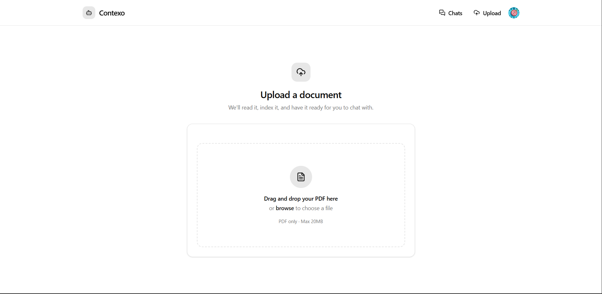
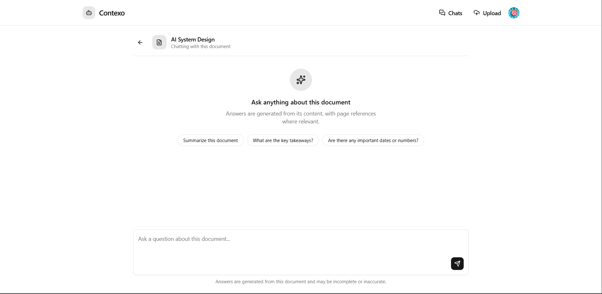
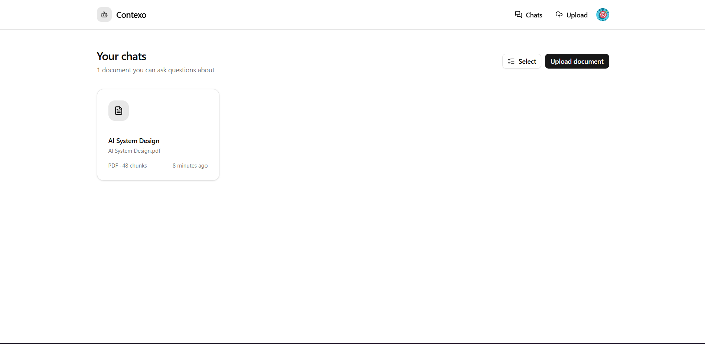
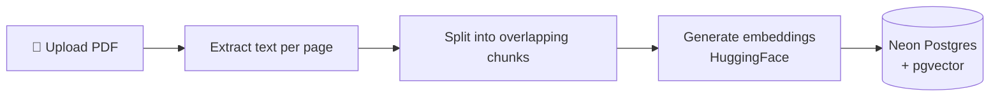
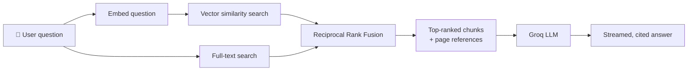

<div align="center">

# 📚 Contexo

**Upload a PDF. Ask it anything. Get answers grounded in the actual page — not a guess.**

A full-stack Retrieval-Augmented Generation (RAG) chatbot built with Next.js, pgvector, and hybrid search — so answers are cited, traceable, and scoped to *your* documents.

[](https://nextjs.org/)
[](https://www.typescriptlang.org/)
[](https://tailwindcss.com/)
[](./LICENSE)
[](#-contributing)
[](https://github.com/your-username/your-repo)

</div>

---

## 📸 Screenshots

<!--
  Replace these with real screenshots before publishing.
  Suggested: put images under /docs/screenshots and reference them here.
-->

<div align="center">

| Home | Upload | Chat |
|:---:|:---:|:---:|
|  |  |  |  |

</div>

---

## 📖 Table of Contents

- [Features](#-features)
- [How It Works](#-how-it-works)
- [Tech Stack](#️-tech-stack)
- [Prerequisites](#-prerequisites)
- [Getting Started](#-getting-started)
- [Project Structure](#️-project-structure)
- [Available Scripts](#-available-scripts)
- [Deployment](#-deployment)
- [Roadmap](#-roadmap)
- [Contributing](#-contributing)
- [License](#-license)

---

## ✨ Features

| | |
|---|---|
| 📄 **PDF Upload** | Drag-and-drop or click-to-browse upload, with inline validation and progress feedback |
| 💬 **Grounded Chat** | Ask questions in plain language, get answers generated *only* from your document's content |
| 📌 **Page Citations** | Every retrieved chunk keeps its source page number, so answers can point back to exactly where they came from |
| 🔍 **Hybrid Search** | Combines vector similarity with Postgres full-text search, fused via Reciprocal Rank Fusion — catches both semantic meaning *and* exact terms (names, figures, acronyms) |
| 🔐 **Multi-Tenant Isolation** | Every document, chunk, and message is scoped by user ID at the database level, not just the route level |
| 🗂️ **Document Dashboard** | Grid view of all your documents with live status (processing/ready/failed), bulk select, and delete |
| 🔑 **Authentication** | Secure sign-in/sign-up via Clerk, protecting every route by default |
| ⚡ **Real-Time Streaming** | Responses stream token-by-token via the Vercel AI SDK |
| 🎨 **Modern UI** | Built with shadcn/ui + Tailwind, dark-mode ready |

---

## 🧠 How It Works

**Ingestion — turning a PDF into searchable knowledge:**



**Retrieval — answering a question:**



Every step above — from which document a chunk belongs to, to who owns it — is filtered by the authenticated user, so retrieval never crosses between documents or accounts.

---

## 🛠️ Tech Stack

| Category | Technologies |
|---|---|
| **Framework** | Next.js 15 (App Router) · React 19 · TypeScript |
| **AI / RAG** | Groq (Llama 3.1) · HuggingFace Inference (embeddings) · Vercel AI SDK · LangChain Text Splitters |
| **Database** | Neon (serverless Postgres) · pgvector · Drizzle ORM |
| **Auth** | Clerk |
| **UI** | shadcn/ui · Radix UI primitives · Tailwind CSS · Lucide icons |
| **Other** | pdf-parse (PDF text extraction) · Zod + React Hook Form · Sonner (toasts) |

---

## 📋 Prerequisites

- Node.js 18+
- npm, yarn, pnpm, or bun
- A [Clerk](https://clerk.com/) account (authentication)
- A [Groq](https://groq.com/) API key (LLM inference)
- A [HuggingFace](https://huggingface.co/) API token (embeddings)
- A [Neon](https://neon.tech/) database with the `pgvector` extension enabled

---

## 🚀 Getting Started

### 1. Clone the repository

```bash
git clone https://github.com/your-username/your-repo.git
cd your-repo
```

### 2. Install dependencies

```bash
npm install
```

### 3. Set up environment variables

Create a `.env.local` file in the root directory:

```env
# Clerk Authentication
NEXT_PUBLIC_CLERK_PUBLISHABLE_KEY=your_clerk_publishable_key
CLERK_SECRET_KEY=your_clerk_secret_key
NEXT_PUBLIC_CLERK_SIGN_IN_URL=/sign-in
NEXT_PUBLIC_CLERK_SIGN_UP_URL=/sign-up
NEXT_PUBLIC_CLERK_AFTER_SIGN_IN_URL=/
NEXT_PUBLIC_CLERK_AFTER_SIGN_UP_URL=/

# Groq AI
GROQ_API_KEY=your_groq_api_key

# HuggingFace
HUGGINGFACE_API_KEY=your_huggingface_token

# Neon Database
DATABASE_URL=your_neon_database_url
```

### 4. Set up the database

```bash
# Enable pgvector (run once against your Neon database)
# CREATE EXTENSION IF NOT EXISTS vector;

npx drizzle-kit generate
npx drizzle-kit push
```

### 5. Run the development server

```bash
npm run dev
```

Open [http://localhost:3000](http://localhost:3000) in your browser.

---

## 🏗️ Project Structure

```
rag-chatbot/
├── app/
│   ├── page.tsx                  # Landing page
│   ├── upload/                   # Drag-and-drop PDF upload
│   ├── chat/
│   │   ├── page.tsx               # Document dashboard (select, delete)
│   │   ├── actions.ts              # Delete server action
│   │   └── [documentId]/          # Dynamic chat route per document
│   └── api/chat/route.ts          # Streaming chat endpoint
├── components/
│   ├── ui/                       # shadcn/ui components
│   ├── ai-elements/               # Chat UI primitives
│   └── navigation.tsx
├── lib/
│   ├── db-schema.ts               # Drizzle schema (documents, chunks, chats)
│   ├── db-config.ts               # Neon/Drizzle client
│   ├── pdf.ts                     # Per-page PDF text extraction
│   ├── chunking.ts                # Page-aware chunking
│   ├── embeddings.ts              # HuggingFace embedding calls
│   └── search.ts                  # Hybrid retrieval (vector + full-text)
├── middleware.ts                  # Clerk auth middleware
└── ...config files
```

---

## 🎨 Available Scripts

| Command | Description |
|---|---|
| `npm run dev` | Start development server (Turbopack) |
| `npm run build` | Build for production |
| `npm start` | Start production server |
| `npm run lint` | Run Biome linter |
| `npm run format` | Format code with Biome |

---

## 🌐 Deployment

### Deploy to Vercel

[](https://vercel.com/new/clone?repository-url=https://github.com/your-username/your-repo)

1. Push your code to GitHub
2. Import your repository in Vercel
3. Add environment variables in the Vercel dashboard
4. Deploy

Also deployable to any Node.js-compatible platform (Netlify, Railway, Fly.io, self-hosted).

---

## 🗺️ Roadmap

- [ ] Tune retrieval quality (chunk size/overlap, embedding model comparisons)
- [ ] Background job for purging soft-deleted documents
- [ ] Word document (.docx) support
- [ ] Configurable similarity threshold to reduce low-confidence answers

---

## 🤝 Contributing

Contributions are welcome!

1. Fork the repository
2. Create your feature branch (`git checkout -b feature/AmazingFeature`)
3. Commit your changes (`git commit -m 'Add some AmazingFeature'`)
4. Push to the branch (`git push origin feature/AmazingFeature`)
5. Open a Pull Request

---

## 📝 License

This project is licensed under the MIT License — see the [LICENSE](./LICENSE) file for details.

## 🙏 Acknowledgments

- [Vercel AI SDK](https://sdk.vercel.ai/)
- [Groq](https://groq.com/)
- [Clerk](https://clerk.com/)
- [Neon](https://neon.tech/) & [pgvector](https://github.com/pgvector/pgvector)
- [Drizzle ORM](https://orm.drizzle.team/)
- [shadcn/ui](https://ui.shadcn.com/) & [Radix UI](https://www.radix-ui.com/)

---

<div align="center">

Made with ❤️ using Next.js and AI

</div>
